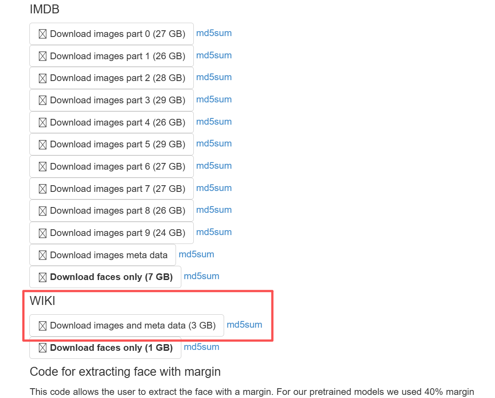
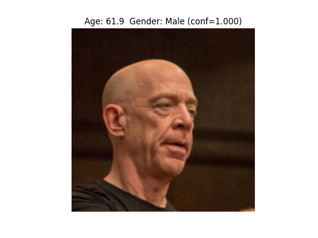
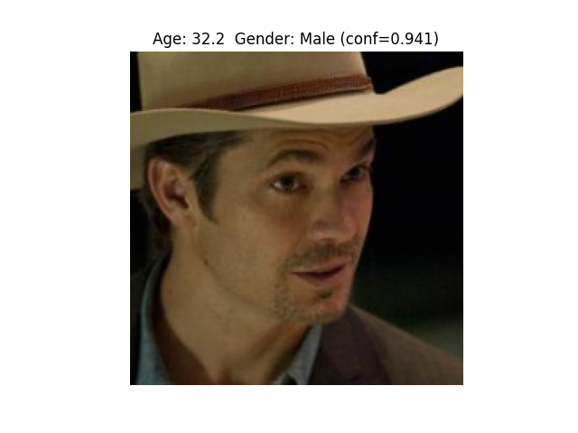

# Pytorch Training on IMDBWiki - A College Course Practice Work

一个校内训练项目，基于`Pytorch`对`IMDB-WIKI`（3GB）人脸数据集进行`resnet50`神经网络训练，实现对人的年龄和性别的识别。

配置要求：

1. N卡。
   - 如果是轻薄本的话，训练大概率会爆显存，只能用于结果展示
   - 1060以上显卡应该可以正常训练
2. 有15GB以上空闲存储空间。

还有必备的Python虚拟环境！包括CUDA、Pytorch的安装，这里不再赘述。使用第三方库如下：

```txt
torch
torchvision
torchsummary
pillow
opencv-python
numpy
tqdm
scipy
matplotlib
```

## 数据集获取

[链接，估计下载奇慢无比](https://data.vision.ee.ethz.ch/cvl/rrothe/imdb-wiki/)

下载该3GB版本



解压后在`conf/config.py`设置参数。

## 生成`Python pickle`预处理文件

```Python
python data_process.py
```

## 训练

训练需要`resnet50`权重文件。如果没有会自动下载。

```Python
python train.py --pkl_path path/to/pkl
```

## 测试

```Python
python predict.py --model_path ./checkpoints/best_model_both.pth --image_path test.jpg --task both
```

## 效果

真实为59岁男性，识别如下：



真实为42岁男性，识别如下：



真实为29岁女性，识别如下：


## 原理

使用`scipy.io.loadmat`从`wiki.mat`提取`dob`出生日期的 MATLAB 序列号）、`photo_taken`（拍摄年份）、`full_path`（图片相对路径）、`gender`（0=女,1=男）、`face_score`（人脸质量分数）。

年龄计算：MATLAB 的 datenum 以公元1年1月1日为基准（值为 366）。转换公式：

```
birth_year = floor((dob - 366) / 365.25)
age = photo_taken - birth_year
```

过滤：
- 年龄范围：MIN_AGE ~ MAX_AGE（默认 0~100）
- 性别有效：gender ∈ {0,1} 且非 NaN
- 人脸分数：face_score > MIN_FACE_SCORE（默认 0.0）
- 图片文件存在：os.path.exists()

输出：一个列表，每个元素是字典 {'image_path': str, 'age': int, 'gender': int}，序列化保存为 .pkl 文件。

数据增强：
- 对训练集：随机水平翻转、色彩抖动（亮度/对比度/饱和度/色调）、归一化（ImageNet 统计量）
- 对验证集：仅缩放 + 归一化，无随机增强

训练基于`ResNet50`模型。

损失函数：
- 年龄：MSELoss（回归）
- 性别：CrossEntropyLoss（二分类）
- 联合：loss = loss_age + loss_gender

优化器：Adam（学习率 1e-4）

学习率调度：ReduceLROnPlateau，当验证损失停滞时（patience=3）将 LR 乘以 0.5

训练步骤（每个 epoch）：
1. 训练模式：前向传播 → 计算损失 → 反向传播 → 更新参数
2. 验证模式：不更新梯度，仅计算损失
3. 若验证损失低于历史最佳，保存模型权重

设备：自动选择 CUDA GPU 或 CPU。

## References

感谢以下项目做出的贡献：

1. [imdb-wiki](https://data.vision.ee.ethz.ch/cvl/rrothe/imdb-wiki/)
2. [pytorch](https://pytorch.org/)
3. [resnet50(on Pytorch)](https://pytorch.org/hub/nvidia_deeplearningexamples_resnet50/)
4. [foamliu/Age-and-Gender](https://github.com/foamliu/Age-and-Gender)

